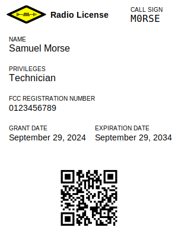
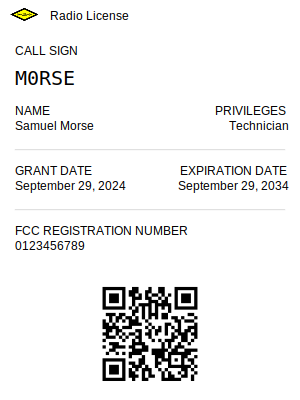

# HAMRadioWallet.com

> An app to add FCC Amateur Radio Licenses to Apple Wallet and Google Wallet.

## Example

 

## TODO

- [ ] Test with missing zip codes, long names, expired licenses, light mode, etc.
- [ ] Close open issue.
- [ ] Fill about page.
- [ ] Fix favicon.
- [ ] Set up GitHub Sponsor.
- [ ] Finalize README.
