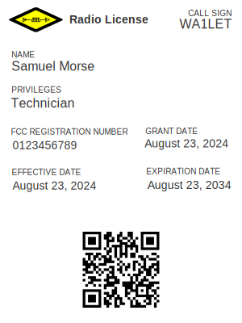

# HAMRadioWallet.com

> An app to add FCC Amateur Radio Licenses to Apple Wallet and Google Wallet.

## Example

## TODO

- [ ] Fix dates being off by one in prod?
- [ ] Fix background on iOS.
- [ ] Add logic for Google Wallet passes.
- [ ] Test with various call signs, missing zip codes, long names, expired licenses, light mode, etc.
- [ ] Add questions to footer.
- [ ] Remove construction banner.
- [ ] Add donation method.
